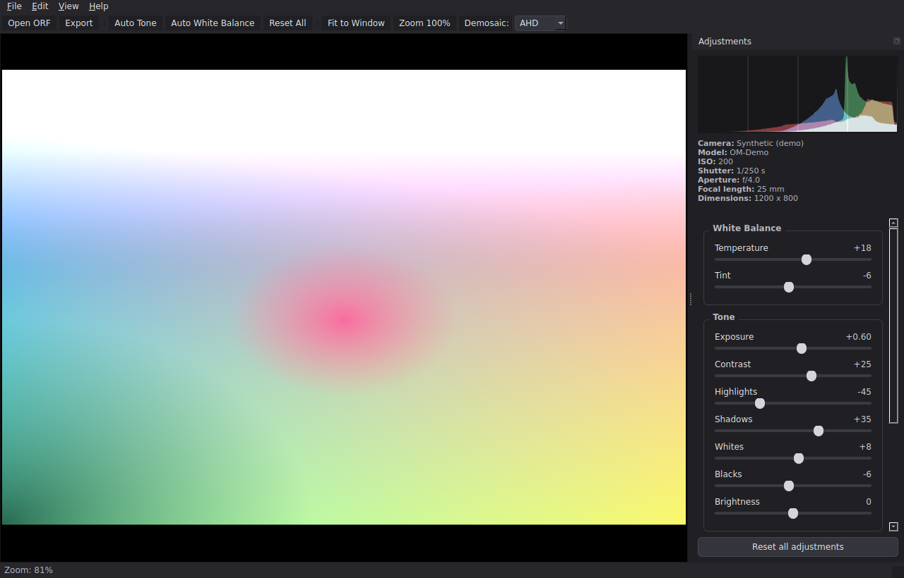

# ORF Photo Editor

A raw image processing application for **Olympus / OM System ORF** files. Load a
raw photo, adjust exposure, white balance, tone, colour and detail
**non‑destructively** with live preview and histogram, then export to JPEG, PNG
or TIFF.



> Regenerate this screenshot with
> `QT_QPA_PLATFORM=offscreen python scripts/render_demo.py docs/ui_demo.png`.

The app decodes raw files with LibRaw (via `rawpy`) into a linear‑light image and
applies all edits itself, so nothing is baked in by the decoder — every slider
stays live and reversible.

---

## Features

- **Open ORF** (and other LibRaw formats: DNG, RW2, NEF, CR2/CR3, ARW).
- **Live, non‑destructive editing** with a background render thread so the UI
  never freezes, and a debounced full‑preview update while you drag sliders.
- **Adjustments**
  - White balance: *Temperature*, *Tint*
  - Tone: *Exposure* (stops), *Contrast*, *Highlights*, *Shadows*, *Whites*,
    *Blacks*, *Brightness*
  - Colour: *Saturation*, *Vibrance*
  - Detail: *Sharpening* (unsharp mask)
  - Geometry: rotate 90°, flip horizontal / vertical
- **Auto Tone** and **Auto White Balance** one‑click helpers, with
  subject-weighted (center + highlight-protected) metering by default.
- **Select Meter Region** — drag a box over the subject and Auto Tone meters
  exposure from it (spot metering), while Auto White Balance treats it as
  neutral (eyedropper). Frees the auto from guessing where the subject is.
- **Live RGB histogram** and capture **metadata** (camera, ISO, shutter,
  aperture, focal length, dimensions).
- **Zoom & pan** viewer (mouse wheel to zoom, drag to pan, fit / 100%).
- **Demosaic algorithm** selector (AHD, VNG, DCB, … whatever your LibRaw build
  supports).
- **Export** full‑resolution JPEG / PNG / TIFF (edits are re‑applied at full
  resolution on export — the on‑screen preview is downscaled only for speed).
- A built‑in **demo image** so you can explore the UI without an ORF file.

## Architecture

The code is split into a GUI‑free processing core and a thin PySide6 UI:

```
orfedit/
├── core/                 # no GUI imports — pure NumPy, fully unit-tested
│   ├── params.py         # EditParams dataclass + slider specs
│   ├── image.py          # RawImage container + synthetic demo generator
│   ├── loader.py         # ORF decoding via rawpy/LibRaw → linear RGB
│   ├── adjustments.py    # pure per-adjustment functions (WB, tone, colour…)
│   ├── pipeline.py       # composes adjustments; renders float/uint8 + histogram
│   └── export.py         # save rendered image to JPEG/PNG/TIFF
├── gui/                  # PySide6 widgets
│   ├── image_viewer.py   # zoom/pan QGraphicsView
│   ├── controls.py       # slider panel built from the core's slider specs
│   ├── histogram.py      # QPainter RGB histogram
│   ├── worker.py         # background decode + render threads
│   └── main_window.py    # wires everything together
├── app.py                # QApplication setup + entry point
└── __main__.py           # `python -m orfedit`
```

The pipeline is a pure function of `(RawImage, EditParams)`. The GUI runs it on a
downscaled preview for interactivity and on the full image for export — the same
code path — which keeps the preview faithful to the exported result.

## Installation

Requires Python 3.9+.

```bash
pip install -r requirements.txt
```

`rawpy` ships LibRaw wheels for most platforms. On Linux, PySide6 needs a few
system GL libraries if they aren't already present:

```bash
sudo apt-get install -y libegl1 libgl1 libxkbcommon0 libdbus-1-3
```

## Usage

```bash
# Launch the GUI
python main.py

# …or open a file straight away
python main.py /path/to/photo.orf

# equivalently
python -m orfedit /path/to/photo.orf
```

Then **File → Open ORF…** to load a photo (or **File → Open Demo Image** to try
the UI immediately), adjust the sliders, and **File → Export…** to save.

### Keyboard shortcuts

| Action            | Shortcut        |
|-------------------|-----------------|
| Open              | `Ctrl+O`        |
| Export            | `Ctrl+S`        |
| Fit to window     | `Ctrl+0`        |
| Zoom 100%         | `Ctrl+1`        |
| Zoom in / out     | `Ctrl++` / `Ctrl+-` |
| Quit              | `Ctrl+Q`        |

Double‑click any slider to reset it to its default.

## Scripting the core (no GUI)

Because the core has no GUI dependency you can batch‑process from Python:

```python
from orfedit.core import load_orf, EditParams, export_image

image = load_orf("photo.orf")
params = EditParams(exposure=0.5, highlights=-40, shadows=30, vibrance=20)
export_image(image, params, "photo_edited.jpg")
```

## Development

Run the test suite (unit tests for the core plus headless GUI smoke tests):

```bash
python -m pytest -q
```

The GUI tests run under Qt's `offscreen` platform, so no display is required.
You can also render a screenshot of the whole UI headlessly:

```bash
QT_QPA_PLATFORM=offscreen python scripts/render_demo.py docs/ui_demo.png
```

## Notes on raw processing

- Files are decoded with `gamma=(1,1)`, `no_auto_bright=True` and camera white
  balance, giving a neutral **linear** starting point. Temperature/tint,
  exposure, tone curves, colour and sharpening are then applied by this app so
  they remain fully adjustable.
- Exposure and white balance are applied in linear light (where they are
  physically multiplicative); tone, contrast and colour edits are applied in
  sRGB‑encoded display space (where the sliders feel perceptually even).
